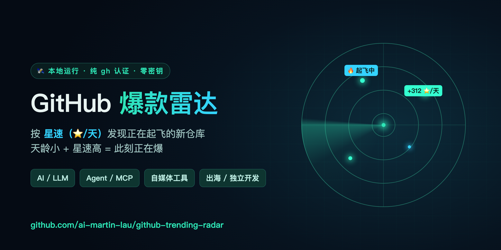
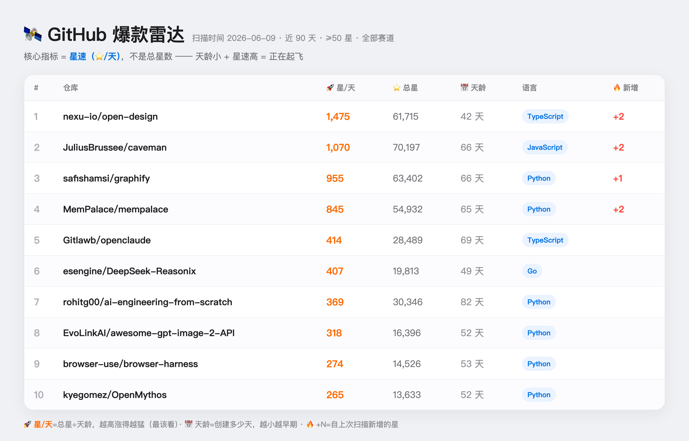

<p align="center">
  <a href="README.md">简体中文</a> · <a href="README_EN.md">English</a> · <a href="README_JA.md">日本語</a> · <a href="README_KO.md">한국어</a> · <a href="README_ES.md">Español</a>
</p>

<p align="center">
  
</p>

## 📊 Vista previa del panel

<p align="center">
  
</p>


# 🛰 Radar de tendencias de GitHub

Un radar de ejecución local para repositorios de GitHub con potencial, la imagen simétrica del «Radar de tendencias de X» —— solo que vigila GitHub.
Capta repositorios «creados recientemente + que ya empiezan a ganar estrellas», ayudándote a descubrir tendencias técnicas, temas de contenido y proyectos de código abierto dignos de estudiar.

## Qué hace

- Escanea 4 segmentos: **IA / LLM**, **Agent / MCP**, **Creadores/Herramientas de contenido**, **Expansión global/Desarrollo indie**
- La métrica clave es la **velocidad de estrellas (⭐/día) = estrellas totales ÷ días de antigüedad**, y no el total de estrellas —— pocos días de antigüedad + alta velocidad = despegando
- Registra instantáneas y, a partir del segundo escaneo, muestra **🔥 nuevas desde la última vez** (una verdadera señal de ascenso)
- **Ranking de explosiones en tiempo real v2**: para los repositorios candidatos obtiene las marcas de tiempo reales de cada star y calcula la **velocidad de estrellas en tiempo real actual** (la velocidad real de las ~100 stars más recientes), lo que permite distinguir «explotando ahora mismo» de «ya enfriado» —— algo que la velocidad promedio no revela. Nota: para repositorios con más de 40 000 estrellas, GitHub limita la paginación, por lo que solo se puede obtener un valor aproximado (la interfaz lo marca como 🟢tiempo real / ⚪aproximado)
- Usa la autenticación de la CLI `gh` con la que ya has iniciado sesión localmente: límites de tasa altos y cero configuración
- Interfaz clara al estilo de Apple, coherente con el Radar de tendencias de X

## Inicio automático al arrancar ya configurado (launchd)

El servicio está instalado para **iniciarse automáticamente al arrancar** (el mismo esquema de launchd que el Radar de tendencias de X, ejecutado con el node de Homebrew,
de modo que puede leer el directorio del Escritorio). Tras arrancar, se ejecuta en segundo plano automáticamente; basta con abrir la siguiente dirección en cualquier momento:

**Dirección del panel → http://127.0.0.1:8788**

### Scripts de doble clic

| Script | Función |
|------|------|
| `打开面板.command` | Abre el panel web (lo inicia automáticamente si no está en ejecución) |
| `重装自启服务.command` | Cuando hayas movido la carpeta / el servicio funcione mal, reinstala e inícialo |
| `卸载自启服务.command` | Detiene y cancela el inicio automático al arrancar |

> ⚠️ Si **mueves toda la carpeta** a otro lugar, el inicio automático dejará de funcionar (el plist guarda la ruta antigua).
> Después de moverla, haz doble clic una vez en `重装自启服务.command` para repararlo.

## Uso solo por línea de comandos (sin abrir la web)

```bash
python3 radar_core.py                 # todos los segmentos, últimos 90 días, ≥50 estrellas
python3 radar_core.py --days 30       # solo brotes nuevos de los últimos 30 días
python3 radar_core.py --track AI      # escanear solo un segmento
python3 radar_core.py --min-stars 200 --top 15
```

## Cómo leer el panel

- **🚀 estrellas/día**: velocidad de estrellas; cuanto más alta, más fuerte sube —— **esto es lo que más debes mirar**
- **📅 días de antigüedad**: cuántos días lleva creado el repositorio; cuanto menor, más «en etapa temprana»
- **🔥 +N**: estrellas añadidas desde el último escaneo (aparece a partir del segundo escaneo)
- En la parte superior, «Más estrellas nuevas desde el último escaneo» = el Top 10 de los que más suben en todos los segmentos

## Si quieres cambiar los segmentos

Las palabras clave de los segmentos están en dos lugares (basta con cambiar uno, según el punto de entrada que uses):
- Web / servicio de inicio automático: `TRACKS` al inicio de `server.mjs`
- Línea de comandos: `TRACKS` al inicio de `radar_core.py`

`topic:xxx` es una etiqueta de tema de GitHub.

## Descripción de archivos

| Archivo | Función |
|------|------|
| `server.mjs` | Servicio web local (Node; lo usa el inicio automático de launchd) |
| `radar_core.py` | Lógica central de escaneo (para uso por línea de comandos) |
| `index.html` | Panel web |
| `com.martin.github-radar.plist` | Plantilla de configuración del inicio automático de launchd |
| `打开面板.command` / `重装自启服务.command` / `卸载自启服务.command` | Scripts de doble clic |
| `snapshot.json` | Generado automáticamente, registra el último escaneo (se usa para calcular las «nuevas») |

## Entorno

- Una CLI de GitHub con sesión iniciada (`gh auth status` muestra que has iniciado sesión)
- node de Homebrew (`/opt/homebrew/bin/node`) — usado por el servicio de inicio automático
- Python 3 (para uso por línea de comandos; incluido con macOS)
